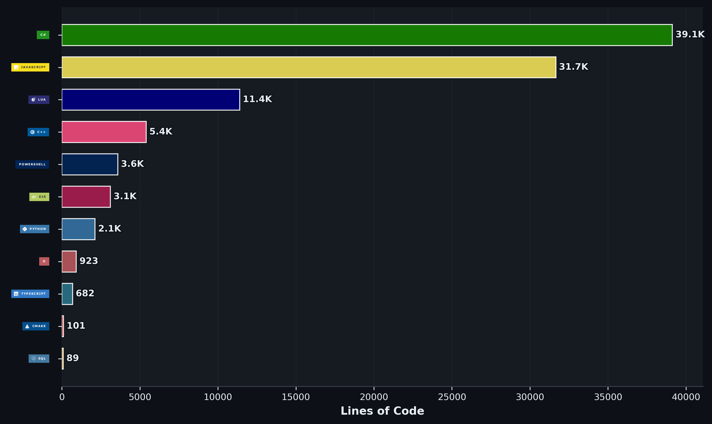

# Henreh, that is me, shocking, I know

**I make terrible mods for games**

Mostly Unity and Unreal Engine. I've also dabbled in Disrupt and, horrifically, Anvil.

## Language analytics mainly to see how my brain is melting

<!-- Generated automatically by .github/workflows/stats.yml. -->

Updated automatically every 0:00 UTC by [GitHub Profile Language Analytics](https://github.com/marketplace/actions/github-profile-language-analytics).
